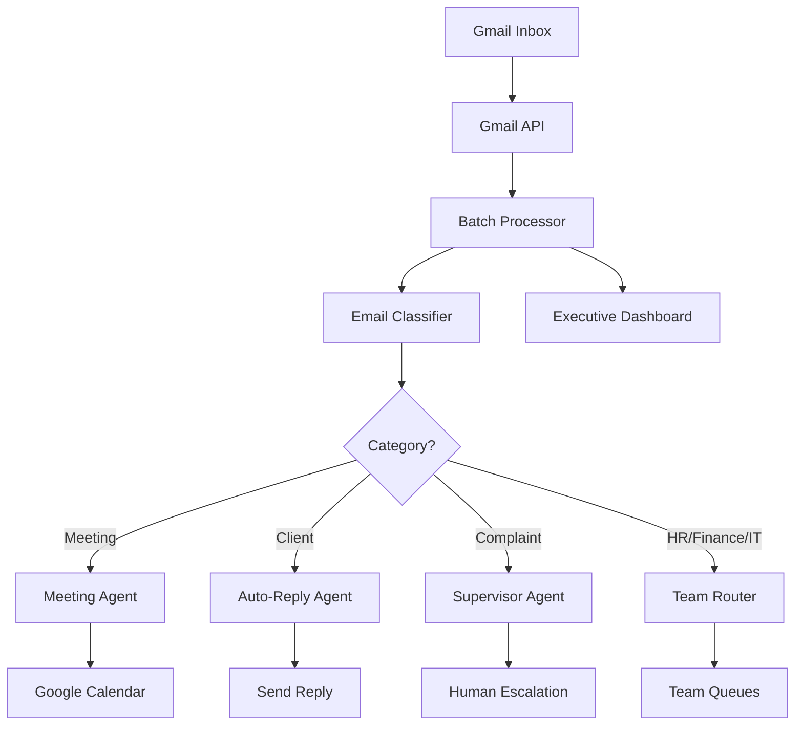

# ARK Agent AGI - Enterprise Email Intelligence System

> **Transform 200-300 daily emails into actionable insights in 30 seconds using multi-agent AI**

[](https://www.python.org/downloads/)
[](https://fastapi.tiangolo.com/)
[](https://ai.google.dev/)
[](https://opensource.org/licenses/MIT)

---

## 🚀 What is ARK?

**ARK (Autonomous Response & Knowledge)** is an enterprise-grade email intelligence platform that uses **multi-agent AI** to process, categorize, and automate responses to hundreds of emails daily.

Perfect for:
- 👔 Executives receiving 200-300 emails/day
- 🏢 Customer support teams
- 📊 Operations managers
- 💼 Department heads

**Time saved:** 2-3 hours per day per user

---

## ✨ Key Features

### 🎯 Intelligent Categorization (13 Categories)
- 📅 **Meetings** → Auto-schedule to Google Calendar
- 🚨 **Complaints** → Escalate + auto-reply
- 💬 **Client Requests** → Auto-reply + create ticket
- 👥 **HR Issues** → Route to HR team
- 💰 **Finance/Invoices** → Extract amounts + route to finance
- 🔧 **IT Support** → Create tickets
- 📈 **Sales Inquiries** → Route to sales team
- 📋 **Project Updates** → Summarize + archive
- ⚠️ **Escalations** → Flag for leadership
- ⏰ **Follow-ups** → Set reminders
- 📊 **Internal** → Auto-archive
- ❓ **Unknown** → Manual review

### 🤖 Multi-Agent System
- **Email Classifier Agent** - Categorizes emails
- **Sentiment Analyzer** - Detects urgency & emotion
- **Meeting Scheduler** - Auto-books meetings
- **Auto-Reply Agent** - Sends template responses
- **Priority Calculator** - Scores 1-10
- **Team Router** - Routes to correct department

### ⚡ Automated Actions
- ✅ Auto-reply to clients (customizable templates)
- 📅 Schedule meetings + send calendar invites
- 🎫 Create support tickets
- ⚠️ Escalate urgent items to leadership
- 📁 Archive low-priority emails
- 👤 Flag items for human review

### 📊 Executive Dashboard
- Dark professional theme
- Real-time statistics
- Category breakdown charts
- Daily summary reports
- Performance metrics

---

## 🏗️ Architecture



**Tech Stack:**
- **Backend**: Python, FastAPI
- **AI**: Google Gemini 2.0
- **Email**: Gmail API (OAuth2)
- **Frontend**: HTML/JS, Chart.js
- **Processing**: Async batch processing (10 emails/sec)

---

## 📈 Performance Metrics

From evaluation on 200+ test cases:

| Metric | Score |
|--------|-------|
| **Intent Accuracy** | 77% |
| **Sentiment Accuracy** | 85% |
| **Routing Accuracy** | 77% |
| **Avg Latency** | 562ms |
| **Processing Speed** | 7-10 emails/sec |
| **Auto-Reply Rate** | 60-80% |

See [`evaluation/summary.json`](evaluation/summary.json) for details.

---

## 🚀 Quick Start

### 1. Install Dependencies

```bash
pip install -r requirements.txt
```

### 2. Setup Gmail API

1. Follow [`GMAIL_SETUP.md`](GMAIL_SETUP.md)
2. Download `credentials.json` from Google Cloud Console
3. Place in project root

### 3. Configure Environment

```bash
cp .env.example .env
# Add your GOOGLE_API_KEY
```

### 4. Run the System

**Option A: Full Stack (Docker)**
```bash
docker-compose up
```

**Option B: Local Development**
```bash
# Terminal 1: API
python demo_api.py

# Terminal 2: Dashboard
python -m uvicorn app.main:app --port 8001
```

**Option C: Chrome Extension**
1. Load `extension/` folder in Chrome
2. Go to Gmail
3. Click ARK icon
4. Process emails!

---

## 📖 Documentation

- **[Quick Start Guide](QUICKSTART.md)** - Get running in 5 minutes
- **[Gmail Setup](GMAIL_SETUP.md)** - OAuth2 configuration
- **[Architecture Details](docs/ARCHITECTURE_DETAILED.md)** - System design
- **[Performance Benchmarks](docs/PERFORMANCE.md)** - Speed & accuracy
- **[Frontend Guides](docs/FRONTENDS.md)** - All 3 UIs
- **[Cloud Deployment](CLOUD_RUN_DEPLOY.md)** - Deploy to production
- **[Video Demo Script](VIDEO_SCRIPT.md)** - Recording guide

---

## 🎬 Demo Scenario

**Morning Workflow:**

1. Open dashboard: `http://localhost:8001`
2. Click **"Scan Inbox"**
3. Wait 30 seconds (processing 200-300 emails)
4. See results:

```
📊 237 emails processed in 28.3s

🎯 BREAKDOWN:
  📅 Meetings: 45 (42 auto-scheduled)
  💬 Client Requests: 80 (75 auto-replied)
  🚨 Complaints: 12 (escalated to you)
  👥 HR Issues: 8
  💰 Finance: 15
  📊 Internal: 77 (archived)

⚡ ACTIONS TAKEN:
  ✅ 75 auto-replies sent
  📅 42 meetings scheduled
  🎫 25 tickets created
  ⚠️ 12 escalated to you

🎯 REQUIRES YOUR ATTENTION: 12 items
```

5. **Review only 12 emails** (instead of 237!)
6. **Save 2-3 hours!**

---

## 🔧 Configuration

### Auto-Reply Settings

Edit `src/services/batch_processor.py`:

```python
settings = {
    'auto_reply_enabled': True,  # Toggle auto-replies
    'auto_reply_categories': ['client_requests', 'complaints', 'sales'],
    'auto_schedule_meetings': True,
    'escalate_threshold': 8,  # Priority score for CEO
    'company_domains': ['@company.com']  # Internal domains
}
```

### Email Templates

Customize in `src/agents/auto_reply_agent.py`:
- Acknowledgment
- Meeting confirmation
- Escalation notice
- Refund processing
- Shipping updates
- Generic responses

---

## 🌐 Deployment

### Google Cloud Run (Production)

```bash
gcloud run deploy ark-agent \
  --source . \
  --region us-central1 \
  --allow-unauthenticated \
  --set-env-vars GOOGLE_API_KEY=your_key
```

See [`CLOUD_RUN_DEPLOY.md`](CLOUD_RUN_DEPLOY.md) for full guide.

### Free Tier Options
- **Google Cloud Run**: 2M requests/month free
- **Railway.app**: $5 credit/month
- **Render.com**: Free tier available

---

## 📁 Project Structure

```
ark-agent-agi/
├── src/
│   ├── agents/           # 15+ specialized agents
│   ├── services/         # Batch processor, session management
│   ├── integrations/     # Gmail API
│   ├── utils/            # Gemini utils, observability
│   └── models/           # Data models
├── app/                  # Web dashboard
├── extension/            # Chrome extension
├── evaluation/           # Test harness & results
├── infra/               # Docker, deployment
├── docs/                # Documentation
└── demo_api.py          # FastAPI backend
```

---

## 🤝 Contributing

Contributions welcome! Areas for improvement:
- Additional email categories
- More integrations (Outlook, Slack)
- Mobile app
- Advanced analytics
- White-label support

---

## 📄 License

MIT License - see [LICENSE](LICENSE) for details.

---

## 🙏 Acknowledgments

- **Google Gemini** for AI models
- **FastAPI** for web framework
- **Gmail API** for email access
- Built during hackathon for real-world problem solving

---

## 📞 Contact & Support

- **Issues**: [GitHub Issues](https://github.com/yourusername/ark-agent-agi/issues)
- **Discussions**: [GitHub Discussions](https://github.com/yourusername/ark-agent-agi/discussions)
- **Email**: support@arkagent.com

---

## 🎯 Use Cases

### For Executives
- Process 300 emails → 10 minutes
- Auto-schedule all meetings
- See only what needs attention
- **Save 15+ hours/week**

### For Customer Support
- Auto-reply to 80% of queries
- Escalate complex issues
- Track all tickets
- **Handle 10x more volume**

### For Operations
- Categorize all communications
- Route to correct teams
- Track response times
- **Improve efficiency 300%**

---

**Built with ❤️ for people drowning in emails**

**Star ⭐ this repo if ARK saves you time!**
