# ARK Agent AGI - Architecture Deep Dive

## 🏗️ System Architecture

### High-Level Overview

```mermaid
graph TB
    User[👤 User/Email] -->|1. Request| API[FastAPI REST API]
    API -->|2. Create Message| Orc[🎯 Orchestrator]
    
    subgraph "Core Orchestration Layer"
        Orc -->|3. Route via Policy| Router[A2A Router]
        Router -->|4. Determine Target| Policy[Routing Policy]
        Orc <-->|Store/Retrieve| Mem[(Memory Bank<br/>SQLite + FAISS)]
        Orc <-->|Log Session| SLog[(Session Logger<br/>JSON Files)]
    end
    
    subgraph "Agent Layer - Specialized Intelligence"
        Orc -->|5a. Classify| Email[📧 Email Agent]
        Email -->|5b. Analyze| Sent[😊 Sentiment Agent]
        Sent -->|5c. Prioritize| Pri[⚡ Priority Agent]
        Pri -->|5d. Execute| Ticket[🎫 Ticket Agent]
        Pri -.->|High Risk| Sup[👔 Supervisor<br/>Human Escalation]
    end
    
    subgraph "Tool Ecosystem - 11+ Tools"
        Ticket -->|Query KB| MCP[📁 MCP FileSystem]
        Ticket -->|Search| DB[(🗄️ Database Tool)]
        Email -->|Track| Ship[📦 Shipping API<br/>OpenAPI]
        Ticket -->|Research| Search[🔍 Google Search]
    end
    
    Email -.->|6. Response| User
    
    style Orc fill:#1a73e8,color:#fff
    style Email fill:#34a853,color:#fff
    style Sent fill:#fbbc04,color:#333
    style Pri fill:#ea4335,color:#fff
```


### Data Flow Example: Refund Request

```mermaid
sequenceDiagram
    participant U as 👤 Customer
    participant O as Orchestrator
    participant E as Email Agent
    participant S as Sentiment Agent
    participant P as Priority Agent
    participant R as Refund Agent
    participant M as Memory Bank
    
    U->>O: "I want a refund for order #12345"
    O->>M: Load customer history (C001)
    M-->>O: {past_intents: ["refund"], sentiment: -0.4}
    
    O->>E: Route to Email Agent
    E->>E: classify_intent() → "refund_request"
    E->>S: Forward with intent="refund_request"
    
    S->>S: analyze_sentiment() → emotion="frustrated", score=-0.6
    S->>P: Forward with sentiment data
    
    P->>P: calculate_priority() → score=7.5, escalate=true
    
    alt Priority Score > 7.0
        P->>R: Route to Refund Agent (high priority)
        R->>R: Check risk, process refund
        R-->>U: ✅ Refund approved: $49.99
    else Priority Score ≤ 7.0
        P->>Supervisor: Escalate to human
    end
    
    O->>M: Save {refund_processed, sentiment=-0.6}
```



### Session & Memory Flow

```mermaid
graph LR
    subgraph "Session Management"
        S1[Session ID:<br/>sess_abc123] --> SM[Session Memory]
        SM --> Msgs[messages[]]
        SM --> Sents[sentiments[]]
        SM --> Tix[tickets[]]
        SM --> KV[kv store]
    end
    
    subgraph "Customer Context (Persistent)"
        C1[Customer ID:<br/>C001] --> CM[Customer Memory]
        CM --> CMsgs[Last 50 messages]
        CM --> CSents[Sentiment history]
        CM --> CKV[Preferences]
    end
    
    SM -.->|Compact after 20 msgs| Archive[History Summary]
    CM -.->|Track trends| Analytics[🔍 Pattern Analysis]
    
    style S1 fill:#1a73e8,color:#fff
    style C1 fill:#34a853,color:#fff
```

### Dual Model Architecture (Innovation!)

```mermaid
graph TD
    Start[🚀 Start Agent] -->|Check .env| Config{GEMINI_MODEL?}
    
    Config -->|gemini-2.0-flash| Flash[⚡ Try Flash Model]
    Config -->|gemini-1.5-pro| Pro[🛡️ Use Pro Model]
    Config -->|Not set| Default[Default: Try Flash first]
    
    Flash -->|Success ✅| Fast[<1s Inference<br/>Paid Tier]
    Flash -->|404/403 Error| Fallback[Auto-fallback to Pro]
    
    Fallback --> Pro
    Pro -->|Success ✅| Stable[2-3s Inference<br/>Free Tier]
    Pro -->|Rate Limit 429| Retry[Exponential Backoff<br/>1s → 2s → 4s]
    
    Retry -->|Success| Stable
    Retry -->|Max retries| RuleBased[Rule-based Fallback<br/>100% Reliable]
    
    Fast --> Result[Return Classification]
    Stable --> Result
    RuleBased --> Result
    
    style Flash fill:#34a853,color:#fff
    style Pro fill:#1a73e8,color:#fff
    style Retry fill:#fbbc04,color:#333
    style RuleBased fill:#ea4335,color:#fff
```



## 🔄 Event Loop Architecture

### Async Processing Chain
```python
# Every agent runs in async event loop
async def route(message):
    # Non-blocking orchestration
    response = await agent.receive(message)
    
# Supports:
- Concurrent agent processing
- Message queueing for paused agents
- Long-running operations without blocking
- Graceful error handling with retries
```

### Message Queue System
```
Agent Paused? → Queue message
Agent Resumed? → Process queued messages sequentially
Fail? → Retry with exponential backoff → Fallback
```

## 📊 Performance Characteristics

| Component | Latency | Throughput | Resilience |
|-----------|---------|------------|------------|
| **Gemini 2.0 Flash** | <1s | High | Retry + Fallback |
| **Gemini 1.5 Pro** | 2-3s | Medium | Retry + Fallback |
| **Rule-based Fallback** | <100ms | Very High | 100% |
| **Memory Lookup** | <10ms | Very High | Local SQLite |
| **Vector Search (FAISS)** | <50ms | High | In-memory |

---
This architecture supports **10,000+ requests/day** with proper deployment! 🚀
