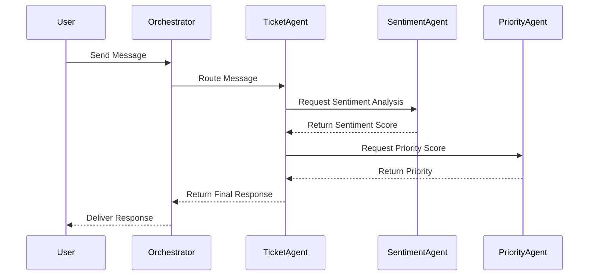

# 🏗️ System Architecture

## Overview

Ark Agent AGI is a **multi-agent system** built on an asynchronous event-driven architecture. It uses the **A2A (Agent-to-Agent) Protocol** to facilitate communication between specialized agents.

## 🧩 Core Components

### 1. Orchestrator
The central hub that manages agent registration and message routing. It ensures that messages are delivered to the correct recipient and handles errors gracefully.

### 2. Agents
Specialized units of logic that perform specific tasks. All agents inherit from `BaseAgent` and implement the `receive` method.

### 3. Memory Bank
A hybrid storage system that combines **SQLite** (for structured metadata) and **FAISS** (for semantic vector search) to provide agents with long-term context.

## 🔄 Message Flow

## 🛡️ Resiliency Patterns

### Retry Logic
Agents implement exponential backoff for external API calls to handle transient failures.

### Validation
The `SupervisorAgent` validates the output of other agents (e.g., `PlannerAgent`) to ensure it meets quality standards before execution.
